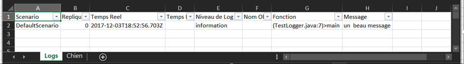
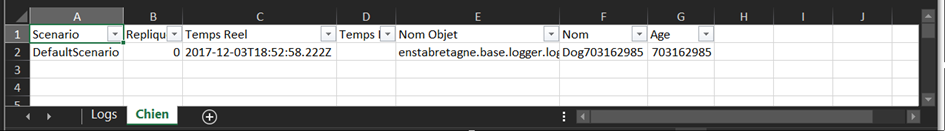

# Le Logger

---

## Fonctions et justification du besoin
Le logger offre deux fonctions principales :
-	Diffuser les traces de journalisation vers différents canaux
-	Diffuser des données structurées vers les mêmes canaux 
### Diffuser les traces de journalisation vers différents canaux
Il est commun de suivre le dérouler d’exécution d’un programme par un affichage dans la ligne de commande de texte. Instinctivement on va utiliser pour cela des « printf » positionnés à divers endroits du code. Il n’est cependant pas forcément aisé de retrouver le lieu du « printf » si on ne s’astreint pas à une rigoureuse définition d’un dictionnaire de texte.

On attend d’une trace qu’elle fournisse non seulement un texte libre mais aussi :
-	L’identification de l’objet source du log
-	L’identification de la ligne dans le code générant le texte
-	L’instant de production de celle-ci (temps réel)
-	La fonction qui a fait appel à cette trace
-	Son niveau de gravité

Usuellement on identifie 4 niveaux de gravité de la trace :
-	**Detail** : trace jugée relevant du détail, utile en phase débug, mais moins en usage quotidien 
-	**Information** : trace permettant d’informer sur le déroulé d’une exécution.
-	**Warning** : trace destinée à attirer l’attention sur un événement qui a un impact notable sur le fonctionnement mais pris en charge
-	**Error** : trace identifiant une erreur, typiquement une donnée attendue obligatoire non valide
-	**Fatal** : trace devant donner lieu à la fermeture de l’application

Enfin, une même trace nécessite d’être visualisée, persistée sur fichiers textes, tableaux, bases de données, ou même diffusée sur un réseau. Ce point fait l’objet des canaux.

Comme il s’agit d’un logger adapté à la simulation et aux plans d’expérience, le Logger ajoute à chaque trace :
-	Le nom du scénario
-	Le numéro de réplique
-	Le temps logique de production de la trace

### Diffuser des données structurées vers les mêmes canaux 

Il est souvent nécessaire d’enregistrer des données structurées pour réaliser des statistiques par exemple. 
On attend du service qu’il:
-	Structure les données selon un type nom/valeur
-	Sérialise ces données structurées et les enregistre dans des formats faciles à exploiter.
-	Classifie les données par type

### Les canaux disponibles et autres options

Les canaux proposés avec le logger fourni sont de différents types :
-	**Sorties adaptées à l’environnement Eclipse** : il s’agit du SysOutLogger. Il génère une trace dans la console Eclipse qui respecte une syntaxe comprise par Eclipse comme un hyperlien. vers la ligne de code ayant généré la trace
-	**Fichiers simple type CSV** : il s’agit du CSVDataLogger. 
-	**Fichiers Excel** : il en existe plusieurs implémentations d’interface Excel/Java via POI. Chacune a des méthodes de gestion de la mémoire différente. La plus robuste et retenue dans le logger est la ExcelDataLogger qui crée des buffers et les écrits régulièrement en fichiers.

Le logger a quelques paramétrages possibles, permettant de définir les noms et lieux des fichiers devant recueillir les traces, les classes non prises en compte pour les traces (filtrage par les classes).

## Mise en oeuvre

### Principe d’architecture

Logger est une classe qui contient les méthodes statiques suivantes, chacune correspondant à un niveau de gravité de journalisation

```java
void Fatal(Object source, String code, String message, Object... args)
void Error(Object source, String code, String message, Object... args)
void Warning(Object source, String code, String message, Object... args)
void Information(Object source, String code, String message, Object... args)
void Detail(Object source, String code, String message, Object... args)
```

Logger possède aussi la méthode Data qui permet d’enregistrer des valeurs d’objet
```java
void Data(Object)
```
> Dans ce cas il faut bien penser à rajouter dans le fragment JSon `levelsToRecord` le mot clé `data`.

L’usage de cette dernière signature de méthode nécessitant une instrumentation de l’objet à enregistrer, une méthode simplifiée a été ajoutée :
```java
void DataSimple(String classement, Object...)
```
> Dans ce cas il faut bien penser à rajouter dans le fragment JSon `levelsToRecord` le mot clé `datasimple`.

Pour invoquer le logger, il y a donc juste à faire :
```java
Logger.Fatal(….) ; 
```

L’appel d’une seule de ces méthodes appellera une méthode équivalente sur chacun des canaux de journalisation. 
Les paragraphes suivants explicitent son utilisation.

### Initialisation
IMPORTANT : dans le main() de tout programme utilisant le Logger commencer toujours comme ci-dessous :
 
Les paramètres du Logger sont à saisir manuellement dans un fichier de configuration au format JSON qui doit :
- se nommer « logger_settings.json »
- être placé sous le répertoire \conf du projet de l’exécutable.

- C’est la convention décidée pour ce logger.

La syntaxe du fichier est celle de l’exemple ci-dessous :
```JSON
{
  "classToFilter": [
    "enstabretagne.simulation.core.implementation.SimObject",
    "enstabretagne.simulation.core.implementation.SimObjectDictionary"
  ],
  "levelsToRecord": [
    "Warning",
    "Information",
    "Error",
    "Detail",
    "Fatal",
    "DataSimple",
    "Data"
  ],
  "loggerConfs": [
    {
      "activate": true,
      "parametres": {
        "FileName": "BasicMovement.xlsx",
        "LoggerKind": "enstabretagne.base.logger.loggerimpl.Excel.ExcelDataLogger",
        "DirectoryName": ".\\log"
      },
      "classToFilter": [
        "enstabretagne.simulation.core.implementation.Convive2",
        "enstabretagne.travaux_diriges.td_corrige.cantine.simEntity.convive.mover.MvtSequenceur",
        "enstabretagne.travaux_diriges.td_corrige.cantine.simEntity.cantine.occupation.CellOccupation"
      ],
      "levelsToRecord": [
        "Warning",
        "Error",
        "Fatal",
        "Data"
      ]
    },
    {
      "activate": false,
      "parametres": {
        "LoggerKind": "enstabretagne.base.logger.loggerimpl.stdoutput.SortieTexteLogger"
      },
      "classToFilter": [
        "enstabretagne.simulation.core.implementation.Convive2",
        "enstabretagne.travaux_diriges.td_corrige.cantine.simEntity.convive.mover.MvtSequenceur"
      ],
      "levelsToRecord": [
        "Warning",
        "Information",
        "Error",
        "Detail",
        "Fatal"
      ]
    }
  ]
}
```

**loggerConfs** : est une liste de canaux et leur configuration propre.

**LoggerKind** : est un paramètre commun à tous les canaux. Il permet de définir la classe implémentant les fonctions qu’il porte. Actuellement trois classes sont implémentées :
```java
enstabretagne.base.logger.loggerimpl.Excel.ExcelDataLogger
enstabretagne.base.logger.loggerimpl.stdoutput.SortieTexteLogger
enstabretagne.base.logger.loggerimpl.csv.CSVDataLogger
```

**classToFilter** : permet de définir les classes qu’on ne souhaite pas journaliser. Si du code à l’intérieur de cette classe appelle la journalisation, aucun des canaux n’enregistrera ses informations. C’est utile une fois que son code est « propre et fonctionnel ». Il est recommandé de rajouter les classes proposées dans l’exemple

**levelToRecord** : permet de définir les niveaux d’information qu’on souhaite journaliser

Ces deux derniers paramètres sont à la fois présents en transverse et en spécifique sur chaque canal.
On peut désactiver ou activer un canal par la propriété « **activate** ».

## Utilisation de la journalisation

La classe Logger grâce à un singleton dispose de méthodes statiques correspondant aux niveaux de gravité des traces.

Prenons la syntaxe d’Information. Les autres ont la même :

`Information(`

`Object obj,` : il s’agit de l’objet sur lequel porte la trace. Usuellement on met « this » comme objet pour désigner l’objet courant. Parfois par exemple dans un main on mettra un objet.

`String function,` : il s’agit d’une simple chaine de caractère. On n’a pas de moyen de récupérer simplement le nom de la fonction en cours d’exécution. On écrit à cet endroit le nom de la fonction où on se trouve

`String message,` ce paramètre et le suivant reprennent la syntaxe d’un printf classique. 

`Object... args` : les trois points indiquent un paramètre optionnel. C’est la syntaxe du printf classique pour injecter des paramètres dans la chaine message si besoin.

`);`

Un exemple typique sera donc :
`Logger.Information(null, "main", "un  beau message");`

Dès que l’instruction Logger est vue la première fois, la classe est chargée en mémoire, et avec elle la configuration du logger. Il est prêt à fonctionner.

Si on souhaite juste tracer une information décorrélé d’un objet concerné il suffit de mettre `null` en paramètre.

Ci-dessous une sortie d’écran typique en utilisant le canal nommé « SortieTexteLogger ».
`(TestLogger.java:7)>main;DefaultScenario;0;pas de temps logique;information;;un  beau message`

On peut voir que le logger sait retrouver dans quel fichier et à quelle ligne la trace a été produite.

La syntaxe utilisée est même compatible du fonctionnement d’Eclipse. Un hyperlien apparait automatiquement sous `TestLogger.java :7`. En cliquant dessus, l’éditeur de code s’ouvre sur le fichier et à la ligne indiquée.

Pour que les informations soient persistées, il ne faut pas oublier :
`Logger.Terminate();`

Le résulat dans Excel est le suivant :


### Utilisation du dataloger.

La classe Logger possède une méthode :

`public static void Data(Object obj)` : il s’agit de donner à Data un objet dont on souhaite enregistrer les données.

Elle peut fonctionner de deux manières.

#### Méthode simple

Une manière simple d’enregistrer les données est d’utiliser la méthode DataSimple()
`Logger.DataSimple("Test", "Nom","Prénom","Age");`

`Logger.DataSimple("Test", "SKYWALKER","Anakin",30.0);`

Le premier paramètre est une chaine de caractère qui permet de classer la donnée. Toute donnée ayant la même chaine de classement sera classée dans la même table.

Cette méthode nécessite donc que la première invocation pour un classement donné d’injecter l’entête. Ensuite, il s’agit de fournir dans le même ordre que l’entête les données à sauvegarder.

Les données sont simplement à mettre les unes derrière les autres pour être prises en compte.

Noter cependant qu’aucune vérification sur les données n’est réalisée. On pourrait très bien saisir une donnée d’âge dans la colonne « Prénom » dans l’exemple ci-dessus.

#### Méthode par intrumentation de Pojo par annotations

Pour instrumenter un POJO afin que certaines valeurs soient enregistrées, il est proposé d’ajouter l’annotation @ToRecord(name=« Nom à Afficher ») sur la classe devant faire l’objet d’un enregistrement. L’attribut name associera l’ensemble des données de cette classe à une feuille Excel de ce même nom dans le cas du Canal Excel d’enregistrement. En CSV cela se traduira par un fichier par élément de classement.

Pour identifier la valeur à enregistrer, il est proposé d’ajouter la même annotation. Par contre elle est à apposer la fonction getter de la valeur à enregistrer. Ceci signifie donc qu’il y aura un check (à runtime seulement) de la conformité de la fonction associée à une signature de getter donc une fonction avec type de retour non void et sans paramètre. L’attribut name associera la donnée à une colonne dont le nom correspondra à ce nom.

L’instrumentation d’une classe Dog ci-dessous ;
```java
@ToRecord(name="Chien")
public class Dog {
	
	
    public String name;
    public int age;

    public Dog() {
    	Random r = new Random();
    	age = r.nextInt();
    	name = "Dog"+age;
	}
    @ToRecord(name="Age")
    public int getAge() {
		return age;
	}

    @ToRecord(name="Nom")
    public String getName() {
		return name;
	}

}
```
Pour enregistrer cette classe par le logger, il suffit alors d’écrire dans le code :
```java
		Dog d = new Dog();
		Logger.Data(d);		
		Logger.Terminate();
```
Dans Excel cela donne :


#### Méthode par implémentation d’une interface
Il s’agit d’implémenter sur l’objet à enregistrer l’interface suivante.
```java
public interface IRecordable {
    /*
     * Renvoie les entêtes correspondants aux données enregistrées => permet de donner un nom aux variables du records
     */
    String[] getTitles();
```
Cette méthode permet de définir l’entête d’un tableau sous forme de chaines de caractères.


```java
    /*
     * renvoie les données sous forme de chaines des données
     */
    String[] getRecords();
```
Cette méthode doit correspondre en nombre d’élément au nombre de colonnes définit par l’entête. C’est dans cette méthode qu’il faut injecter les valeurs à enregistrer.

```java
            /*
             * permet de catégoriser l'enregistrement. Sera utilisé pour classer les données enregistrées
             */
            String getClassement();
}
```
Cette méthode permet de typifier la donnée. Il s’agit simplement de donner un nom correspondant à ce qu’on enregistre.

Un exemple typique d’usage peut être par exemple :

```java
Logger.Data(new IRecordable() {
	
	@Override
	public String[] getTitles() {
		String[] titles= new String[]{« Nom », « Prénom », « Age »};
		return titles;
	}
	
	@Override
	public String[] getRecords() {
		String[] records= new String[]{« VERRON », « Olivier », « 900 »};;
		return records;
	}
	
	@Override
	public String getClassement() {
		return "Personnes";
	}
});
```

On voit qu’on fournit un objet instancié via une classe anonyme.

Traduit avec un canal de type Excel, il va créer une feuille Excel de nom Personnes, un tableau avec un entête nom, prénom et age dans 3 colonnes. Il va ensuite instancier une ligne sous cet entête les 3 valeurs Verron pour le nom, Olivier pour le prénom, 900 pour l’âge.

Si on duplique le code ci-dessus, la même feuille Personnes va être réutilisée, le même entête va être réutilisé, mais une deuxième ligne sera créée sous la précédente et de nouveau avec les 3 valeurs Verron pour le nom, Olivier pour le prénom, 900 pour l’âge.

Une bonne pratique sera simplement de faire implémenter à l’entité de simulation l’interface en question. Si par exemple vous avez une entité de simulation c1 de la classe `Coiffeur` qui implémente `IRecordable`, enregistrer la classe consistera simplement à écrire :
`Logger.data(this) ;`

#### Helper

Si vous travaillez avec python à la place d'Excel, ce helper n'a pas d'intérêt.

Pour l’analyse statistique, il est intéressant de faire des classifieurs de données.

Le `Logger` vient avec une classe : `CategoriesGenerator`.

Le classifieur fonctionne pour des données de type double.

Il s’initialise grâce à la méthode ci-dessous :
```java
public CategoriesGenerator(double borneBasse, double borneHaute, int nbCategories,int minimumintegerDigit,int minimumFractionDigit)
```

Un ensemble de segments vont être créés et répondant aux paramètres ci-dessus. Les deux derniers paramètres de la fonction servent à créer des arrondis décimaux des doubles qui seront à classer.
Cette classe une fois instanciée est utilisée avec la méthode :
```java
public Segment getSegmentOf(double i)
```

On transmet à cette fonction la valeur qu’on souhaite classifier. Le segment renvoyé dispose d’une méthode toString. Le segment peut être facilement enregistré par le datalogger. Le `toString` renvoie un index, la moyenne du segment et le segment sous forme de chaine séparés d’un espace facile à parser dans Excel.

